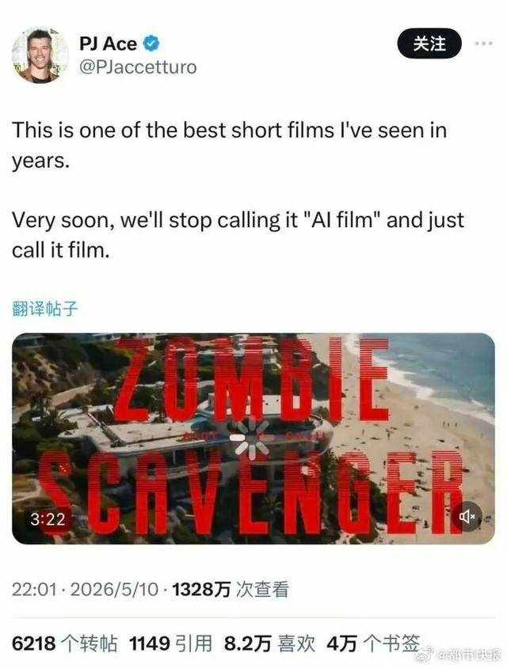
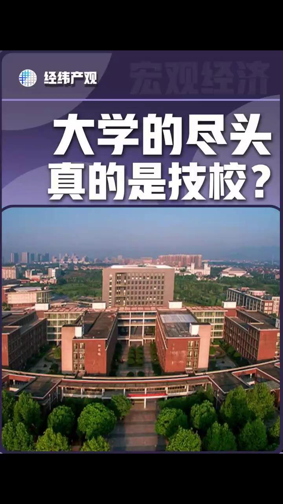

---
next:
  text: '书籍作品'
  link: '/books/'
---

# AI名人传

## 序言：AI重塑一切——走向有益的未来

人工智能，正以前所未有的速度深刻改变国家竞争格局、社会组织形态，以及每个人的学习、工作、生活等。

但这场革命不只是威胁——**它更是人类文明史上最大的机遇**。从诊断疾病到机器人进入家庭，从个性化教育到科研突破，AI正在帮助人类解决那些曾经被认为不可能解决的问题。

---

## 全球领袖看AI：机遇与福祉

### 王兴兴，宇树科技创始人兼CEO

> *"未来3—5年，人形机器人将会加速在各行业应用落地，落地方向包括服务业、工业场景和救援救灾等场景。如果顺利，未来1—2年或者2—3年可以达到人形机器人的ChatGPT时刻。"*

**王兴兴描绘的未来图景**：
- 机器人走进家庭，照顾老人、教育孩子、做家务
- 机器人走进工厂，替代高危工种，让人类远离危险
- 机器人走进医院，辅助医护人员，拯救生命
- *"将来机器人有希望给国家缴税"*

> **来源**：21经济网
> [《宇树科技王兴兴：将来机器人有希望给国家缴税》](https://www.21jingji.com/article/20250809/herald/c4d4f29986255a38827a24d3ef4902b7.html)

---

### 黄仁勋，NVIDIA创始人兼CEO

> *"AI真正的价值，是帮人类节省所有琐碎、重复的时间，让人类可以专注于高价值的决策和人脉。"*

> *"下一代要学的不是写程式，而是生命科学。因为 AI 正在改写医疗的未来。"*

> * " AI不会取代人人的使命，它会放大人的能力，所以，如其说AI会取代你，不如说，更擅长使用AI的人，可能会取代你。" *

**黄仁勋描绘的医疗革命**：
- NVIDIA Clara模型用于医疗健康领域的生物医学AI
- 从靶点发现到分子设计，AI加速药物研发
- AI辅助诊断，早期发现癌症、阿尔茨海默病

---

### 山姆·奥特曼（Sam Altman），OpenAI CEO

> *"Let society and the technology co-evolve, and build these systems that deliver tremendous value while meeting safety requirements."*
>
> *"让社会和技术共同进化，构建既创造巨大价值又满足安全要求的系统。"*

> *"AI will probably most likely lead to great companies and solve some of the biggest problems we have."*
>
> *"AI极有可能带来伟大的公司，并解决我们面临的一些最大问题。"*

---

### 李飞飞，斯坦福大学教授、「AI教母」

> *"在这个系统的每个环节——从基础生物学研究，到临床诊断、医疗服务和公共卫生——AI都能发挥重要作用。"*

> *"令人振奋的是，AI正在帮助我们实现那些曾经被认为不可能的事情。"*

**李飞飞正在推动的AI医疗前沿**：
- AI辅助诊断癌症，早期发现，准确率超医生
- AI预测阿尔茨海默病，发病前7年预警（准确率72%）
- AI加速药物研发，从数年缩短到数月

---

### 联合国秘书长 安东尼奥·古特雷斯

> *"AI有巨大潜力加速实现可持续发展目标，帮助我们应对气候变化、贫困、疾病等全球挑战。"*

---

## AI正在发生的医疗突破

### 诊断革命：AI超越医生

| 领域 | AI表现 | 传统医生 |
|------|--------|----------|
| 复杂临床病例诊断 | GPT-4 **96%** | 约85% |
| 阿尔茨海默病预测（提前7年） | **72%** 准确率 | — |
| 轻度认知障碍转归预测 | **81%** 准确率 | 临床诊断 |
| 癌症早期检测 | 与专家 **相当** | 专家 |

> **数据来源**：斯坦福大学《2025年AI指数报告》

### FDA批准：AI医疗设备爆发式增长

- **2015年**：仅6款AI医疗设备获批
- **2023年**：**223款**AI医疗设备获批
- 增长近**40倍**

> **来源**：FDA & 斯坦福HAI

### 蛋白质工程：AI设计的蛋白质自然界需5亿年进化

**AlphaProteo**设计的结合剂：
- 比现有方法有效性高出**300倍**
- 牢固度提升约**10倍**
- 用于药物开发、诊断和生物技术应用

**ESM3**设计的esmGFP（人工绿色荧光蛋白）：
- 自然界需要**5亿年**才能发展出这种蛋白
- 开源，赋能全球科学家

---

## 中国"AI+"战略：政策红利

### 国务院《关于深入实施"人工智能+"行动的意见》

2025年8月，国务院印发**国发〔2025〕11号文件**。

**核心目标**：
- 到2027年，打造**1000个**高水平工业智能体
- 建成3－5个通用大模型深度应用标杆
- 推动AI核心产业规模超**万亿**

**六大行动**：AI+科学技术、AI+产业发展、AI+消费提质、AI+民生福祉、AI+治理能力、AI+全球合作

> **文件来源**：国务院官网
> [《关于深入实施"人工智能+"行动的意见》](https://www.gov.cn/zhengce/content/202508/content_13315815.htm)

---

### 工信部《"人工智能+制造"专项行动实施意见》

2026年1月，工信部等八部门联合印发。

**关键数据**：
- 2024年中国AI核心产业规模超**9000亿元**
- AI企业数量超**5000家**
- 灯塔工厂数量占全球**45%**

> **文件来源**：国家发展改革委
> [《"人工智能+制造"专项行动实施意见》](https://www.ndrc.gov.cn/xxgk/jd/jd/202508/t20250829_1400153.html)

---

## 各地OPC AI公司补贴政策

**OPC（One Person Company，一人公司）**——一个人、一台电脑、一套AI工具，正在成为AI产业化落地的新赛道。

### 深圳
- **训力券**：最高**1000万元**
- **模型券**：最高**200万元**
- **语料券**：最高**200万元**

### 武汉
- 算力费用补贴：**50%**，最高**20万元**，最长**3年**
- 初创企业资助：最高**100万元**

### 北京等23城
- 专项扶持政策，覆盖超**80%**的OPC创业者

> **政策来源**：中新社
> [《多地出台扶持政策 OPC成AI产业化落地新赛道》](https://www.chinanews.com.cn/cj/2026/03-01/10578853.shtml)

---

## 企业直接招聘高中生培养AI人才

### 腾讯「青科实训营」
- **面向**：全球13-18岁的中学生
- **方向**：金融科技产品、微信小程序+AI、微信搜索+AI
- **特色**：腾讯总监级员工带教，接触真实产品案例

### 吉利「跨时代跃迁人才培养计划」
- **面向**：高中毕业生（直接跳过本科阶段）
- **方向**：新能源、人工智能、低空飞行、低轨卫星
- **配置**：企业CEO + 首席科学家双导师 + AI智能体导师

### 硅谷标杆：Palantir
- 从500多名应聘者中选出**22名高中毕业生**
- 月薪**5400美元**，转正后年薪**17万美元**（约合人民币120万）

> *"我们找的不是熟练工，而是潜力股。更看重创新思维、学习能力和解决问题的热情。"* —— 腾讯

> **来源**：上观新闻
> [《腾讯向中学生推出暑期实践、吉利直接招高中生，释放了什么信号？》](https://www.shobserver.com/staticsg/res/html/web/newsDetail.html?id=1093365)

---

## 创作初衷

为什么写《AI名人传》？

缘起于一次周末友人聚会。大家聊起"龙虾"热，其间一位小朋友突然问爸爸："什么是AI幻觉？" 刹那间，房间里安静了好一会儿。

随后，大人们聊到当前AI的飞速发展，以及它对所有人的影响。大家意识到，无论是国家、学校还是企业，都面临着一个新课题，需要重新去认识和学习。谈到AI相关的书籍时，有人感叹："市面上的书，要么偏向某一类技术教程，读起来枯燥难懂；要么是商业报道，缺乏技术深度；又或者是学术论文，普通人根本看不进去。而梳理AI技术发展进程的通识类读物，实在太少了。" AI本身横跨多个学科，近两年发展迭代尤其快。当朋友们得知我这些年一直关注AI前沿资讯，也读了一些相关的书，算是有了一点点了解，便推举我写点东西，在圈内分享。

大家的要求分成了两派：一是希望写一本适合孩子或完全零基础读者的AI启蒙科普读物；二是希望做一份能帮助AI爱好者拓展知识、学以致用的内容。可等我真正提笔去写，才发现难度远超想象。别说写了，光是查资料，那些AI术语就像俄罗斯套娃，一个接着一个冒出来。

就在我几乎要放弃的时候，有一天查一位AI名人的解决问题的思路，突然被触动了，那是一种顿悟的瞬间（a-ha moment）。此后我坚持了下来，推进得也顺利多了，不再害怕碰到不熟悉的技术或术语。这还促成了我后来总结提炼的另一份资料，它大致属于学习方法或认识论的范畴，主要得益于AI名人的智慧，我暂且把它叫作《AI名人智慧思维》。

工欲善其事，必先利其器。在这次创作中，最大的利器就是AI Agent的辅助。从2026年4月初开始，我先使用了"小龙虾"（OpenClaw），到月底换成了"爱马仕"（Hermes Agent）。我负责总体构思、筹划、审核和校对，AI Agent负责具体执行。用到的模型主要包括DeepSeek、豆包、MiniMax等。至于这个网站的搭建——对我这样一个非计算机专业、完全不懂代码的人来说，没有AI Agent的帮助，是万万不可能完成的。所以我觉得，2026年可算是AI Agent元年，是AI开始动手做事的一年。《AI名人传》这个项目，算是人机协同的一次小小尝试。网站上线那天，朋友开玩笑说："你这不就是个OPC公司的雏形吗？"我笑了笑没接话，心里清楚自己还差得远。不过事后想想，不妨借他吉言，姑且叫它OPC公司——山邑咨询，员工就两位：我（Oliver），以及我的Hermes Agent（我管它叫StarSeaGo）。

> *"如果你想了解深度学习，就去读Hinton的故事。如果你想要理解AI的未来，就去理解那些创造它的人。"*

《AI名人传：那些让"龙虾"活起来的人——Pro/Max/Mega版》——以人物为线索，以故事为载体，讲述AI从图灵到GPT的史诗历程，品味20多位AI名人的百味人生与智慧，解析AI技术的迭代演进与发展，分享AI Agent热门场景下的落地实践与交流。它适合从AI启蒙到从业者等不同阶段的读者。

---

## 各版本介绍

| 版本  | 定价 | 风格 | 适合人群 | 内容 |
|------|------|------|----------|------|
| **Pro版** | ¥59  | 客观叙述+知识点科普 | 普通读者 | 20位+名人完整故事+引子+结语+科普知识+互动 |
| **ProA版**  | free | 艾萨克森文艺叙事风 | 喜欢故事性阅读 | 20+位名人深度叙事+人物内心 |
| **ProB版**  | 99  | AI名人智慧思维    | AI使用者 | 萃取AI名人智慧，总结他们学习和问题解决的心法 |
| **Max版**   | ¥159 | Pro版+技术深化 | AI爱好者 | 32位+AI名人总榜及关键技术贡献+AI技术演进历史及趋势+5章深度技术扩展 |
| **Mega版**  | ¥299 | Max版+论文精读+AI实践 | AI从业者/研究者 | 6章论文解析+AI场景解读+AI应用实战 |

---

## 快速开始

| 选择 | 操作 |
|------|------|
| 想先看看内容 | [免费试读Pro版（1/3/5章）](/books/pro/) |
| 想看完整14章 | [阅读ProA版（14章全展示）](/books/pro-a/) |
| 想了解各版本区别 | [查看版本对比](/purchase/) |
| 想直接购买 | [购买渠道](/purchase/) |

## 视频展播

  

    

      
▶

      
      
云南中专生AI手搓好莱坞大片

    

    

      
▶

      
      
大学的尽头是技校？！

    

    

      
▶

      
      
第一章：艾伦·图灵

    

    

      
▶

      
      
创作背后的故事

    

  

  <button class="carousel-arrow left" onclick="carouselScrollLeft()">‹</button>
  <button class="carousel-arrow right" onclick="carouselScrollRight()">›</button>

---

*最后更新：2026年5月*

---